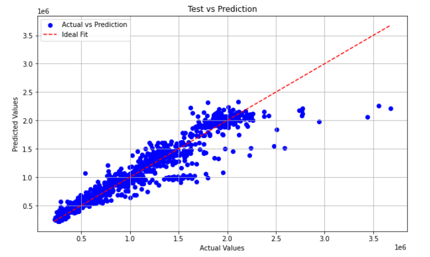
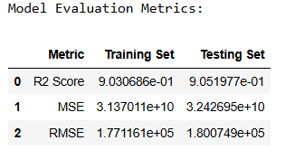
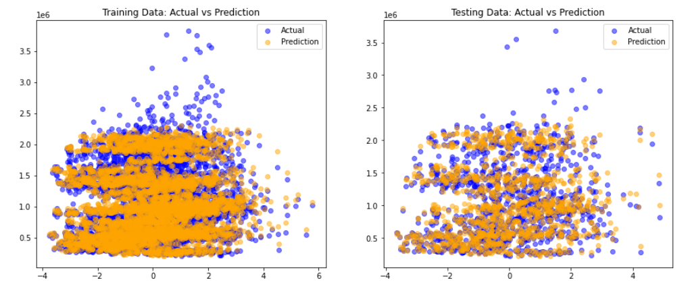
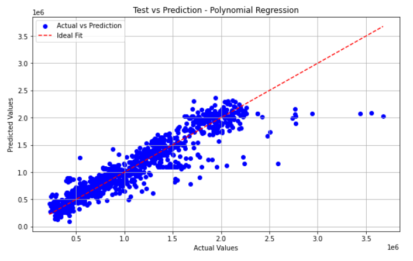
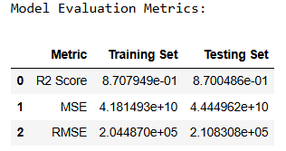

## Walmart Sales Prediction   

The Walmart Sales Prediction project aims to analyze historical sales data from various Walmart stores and develop machine learning models to forecast future sales. This comprehensive project combines data preprocessing, exploratory data analysis (EDA), and advanced modeling techniques to understand patterns and predict outcomes effectively. Through detailed analysis and predictive modeling, this project seeks to optimize inventory management, improve sales strategies, and enhance decision-making processes. 

## Introduction

This project leverages the extensive data generated by Walmart, one of the largest global retailers, to analyze sales trends and predict future sales volumes. It encompasses a series of phases starting with data preprocessing to clean and structure the data for analysis. During the exploratory data analysis (EDA), we delve into the data to identify key factors that influence sales and explore the relationships between various variables.

The dataset includes weekly sales, store details, holiday flags, and external factors such as temperature, fuel prices, CPI, and unemployment rates, providing a comprehensive basis for analysis. In the modeling phase, we employ various techniques including linear and polynomial regression, as well as PCA, aiming to develop robust models that accurately forecast sales. These models are evaluated on their accuracy and predictive power, contributing to strategic business decisions that help Walmart optimize its operations and increase profitability.

## DataSet

This dataset, titled "Walmart_Store_sales," spans from 2010-02-05 to 2012-11-01 and includes sales data for various Walmart stores. It features details such as store number, weekly sales, and the date of sales, along with external factors like temperature, fuel price, Consumer Price Index (CPI), and unemployment rates that might influence consumer behavior. Additionally, the dataset marks whether the data falls within special holiday weeks such as the Super Bowl, Labour Day, Thanksgiving, and Christmas, which are known to significantly impact sales volumes. By analyzing this dataset, we aim to uncover patterns and factors that influence weekly sales and develop predictive models to better forecast future sales activities at Walmart stores.

Link : https://www.kaggle.com/datasets/yasserh/walmart-dataset

## Preprocessing

In the Walmart sales prediction project, the preprocessing began with the dataset being loaded from the 'Walmart.csv' file into a DataFrame. The 'Date' column was transformed into datetime format to facilitate time-series analysis, enhancing the dataset's utility for temporal evaluations. We enriched the data by adding new columns such as 'weekday', 'month', and 'year', derived from the 'Date' column, to provide deeper insights into temporal sales patterns. To ensure the integrity and accuracy of our analysis, we thoroughly addressed missing values and removed irrelevant columns. We also processed categorical variables using one-hot encoding, converting 'Holiday_Flag' into a format suitable for modeling. To mitigate the impact of outliers, we applied the Interquartile Range (IQR) method to key features, removing extreme values that could skew our analysis and model predictions. Lastly, we standardized the numeric columns to a common scale, which is crucial for optimizing the performance of machine learning models and ensuring comparability across different metrics. These preprocessing steps were crucial for cleaning and structuring the data, setting a solid foundation for the subsequent exploratory data analysis and predictive modeling phases.

## Exploratory Data Analysis (EDA)

During the exploratory data analysis phase of the Walmart sales prediction project, we delved into the dataset to uncover underlying patterns and relationships. We began by reviewing summary statistics and distributions of key variables like weekly sales and temperature. Using visualization tools such as histograms and heatmaps, we observed sales distributions and explored correlations between variables to identify potential predictors for our models.

We also examined sales trends over time through line charts, which highlighted seasonal patterns and the impact of holidays on sales. Scatter plots helped us investigate the relationships between continuous variables, such as temperature and sales. This comprehensive exploration not only provided valuable insights into the factors affecting sales but also guided our feature selection and model development processes.

## Predictive Modelling

In the predictive modeling phase of the Walmart sales prediction project, we aimed to develop robust models capable of forecasting weekly sales with high accuracy. We began by partitioning the dataset into training and testing sets, using 80% of the data for training and 20% for testing to ensure a balanced approach to learning and validation. The data was then standardized using StandardScaler to normalize the feature scales, enhancing model performance by providing each feature with equal importance.

Principal Component Analysis (PCA) was employed to reduce the dimensionality of the data while retaining most of the variance. This helped in simplifying the model without losing critical information, and the number of components was chosen to capture 95% of the variance to maintain the data integrity. Linear Regression and Polynomial Regression models were then fitted to these transformed datasets. The Polynomial Regression was enhanced with feature selection to focus on the most impactful predictors.

Model performance was rigorously evaluated using R² score, Mean Squared Error (MSE), and Root Mean Squared Error (RMSE) to assess both the accuracy and the predictive power of the models. Visualizations were crucial at this stage: scatter plots displayed the relationship between actual and predicted sales values, providing a clear visual assessment of model effectiveness.

By integrating PCA with regression models and focusing on polynomial features, we created a predictive framework that not only highlights key sales drivers but also predicts future sales with a considerable degree of reliability. The process concluded with detailed evaluations, where models were compared to identify the best performer based on the predefined metrics, ensuring the selection of the most effective model for deployment in real-world scenarios.

## Results and conclusion

**Linear Regression**

In the Walmart sales prediction project, the linear regression model demonstrated a robust ability to forecast weekly sales. The scatter plot showcasing the test predictions aligned closely with the ideal fit line, indicating a good model accuracy with an R² Score of about 0.90 for both training and testing sets. This score suggests that the model can explain approximately 90% of the variability in sales data. The Mean Squared Error (MSE) and Root Mean Squared Error (RMSE) values were also consistent between the training and testing datasets, underscoring the model's effectiveness in generalizing from the training data to unseen data. Additional plots of actual versus predicted sales for both datasets illustrated a reasonable distribution of predictions around actual sales values, though some variability in accuracy across different sales figures was observed. Overall, the model's performance highlights its potential utility in aiding Walmart's strategic planning and operational adjustments.

<table>
  <tr>
    <td>
      
    </td>
    <td>
      
    </td>
  </tr>
</table>

<table>
  <tr>
    <td>
      
    </td>
  </tr>
</table>

**polynomial Regression**

In the Walmart sales prediction project, the polynomial regression model exhibited a strong capability to predict weekly sales. The scatter plot for the test predictions revealed a tight alignment with the ideal fit line, demonstrating notable accuracy with an R² Score of approximately 0.87 for both training and testing phases. This indicates that the model successfully explains around 87% of the variability in the sales data, a strong performance given the complex nature of retail sales dynamics. The Mean Squared Error (MSE) and Root Mean Squared Error (RMSE) metrics further confirmed the model’s reliability, with comparable values between the training and testing sets, which highlights the model’s ability to generalize effectively across different data samples.

Visualization of actual versus predicted sales through additional scatter plots for both training and testing datasets provided a visual affirmation of the model's efficacy. These plots showed a good clustering of predictions around the actual sales values, demonstrating the model’s adeptness at capturing the overarching sales trends, despite some variations in prediction accuracy at different levels of sales. Altogether, the polynomial regression model proves to be a valuable analytical tool for Walmart, aiding in enhanced decision-making for inventory management and promotional strategies by providing dependable sales forecasts.

<table>
  <tr>
    <td>
      
    </td>
    <td>
      
    </td>
  </tr>
</table>

<table>
  <tr>
    <td>
      
    </td>
  </tr>
</table>